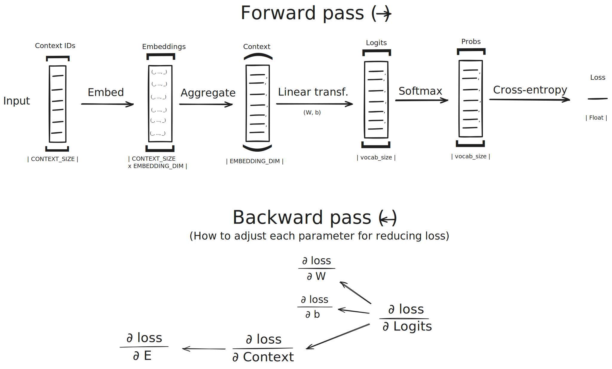

# Desarrollo a través del tiempo

Este proyecto empezó con la idea de aprender dos cosas:
* Lenguaje C, manejo de memoria, punteros, etc., con la idea de preparar un poco el terreno para la universidad.
* Inteligencia Artificial de manera local, con la idea de facilitar el uso de modelos más potentes (previamente diseñados) en videojuegos.

## Tokenizer
Como la idea siempre fue priorizar el aprendizaje, mantener la sencillez y eficiencia fue un activo muy valorado al encarar el paso inicial. Se parte de un `data.txt` con texto plano, se lo tokeniza byte a byte asignándole a cada uno distinto un ID, y se obtiene un arreglo de números enteros. En el archivo `defines.h` definimos la macro `MAX_VOCAB`, dejando en claro que vamos a usar, a lo sumo, 256 caracteres (más adelante veremos que en realidad serán 255 como máximo).

### vocab_t
El struct de este módulo tiene como atributos:
* `size`, un entero sin signo de 16 bits porque queremos que a lo sumo tenga 256 caracteres inclusive, y dejarlo de 8 nos cortaría en 255
* `char_to_id`, un arreglo de enteros con signo de 16 bits que mapea un caracter a su ID. Elegí este tipo porque para filtrar los caracteres que ya fueron incluidos en el vocabulario, previamente los inicializaremos con -1 como ID a todos los caracteres.
* `id_to_char`, un arrego de enteros sin signo de 8 bits que mapea un ID (como dijimos que vamos a usar ASCII, con 256 nos alcanza para tener todos los caracteres de un texto sencillo) a su respectivo caracter.

## Dataset
Una vez tokenizado el texto, tenemos que tomar muestras del mismo. En el `defines.h` definimos la macro `CONTEXT_SIZE` que nos sirve para decidir qué tan larga será la ventana de caracteres (IDs) que vamos a tomar para samplear.

### dataset_t
El struct de este módulo tiene como atributos:
* `num_samples`, la cantidad de samples que tomamos de un texto.
* `inputs` y `targets`, que deben ser vistos en conjunto. El input iésimo (un vector de IDs) apunta al target iésimo (el ID que le sigue en el texto original). Por este motivo, inputs es un puntero a punteros de IDs, y targets es un puntero a IDs.

## Embeddings
Construido el dataset, el modelo no va a aprender de números enteros. Hay que convertir cada ID en un punto en el espacio vectorial.

### embedding_table_t
El struct de este módulo tiene como atributos:
* `vocab_size`, un entero sin signo de 16 bits porque queremos llegar hasta 256 inclusive como máximo.
* `data`, un puntero a floats que se va a usar como una lista o matriz de vectores, considerando que todos tienen un tamaño fijo definido en `defines.h` llamado `EMBEDDING_DIM`. El token iésimo tendrá el embedding `data[i]` si lo pensamos como lista, considerando que en la indexación la i está multiplicada por el tamaño de los embeddings.
* `dE`, un buffer de gradientes para los embeddings. En la etapa de aprendizaje, este atributo es el que nos permitirá ir acercando tokens que sean semejantes en el espacio vectorial (como por ejemplo, vocales cerca de otras vocales, signos de puntuación entre sí, etc.).

La primera función distintiva y característica del aprendizaje automático en este proyecto: `embed_and_aggregate` toma un input (arreglo de IDs) y "colapsa" todos los embeddings de los IDs en un solo vector llamado `context_vector`, sumándolos.

## Output layer
Dado un input (repito, vector de IDs), ¿qué va a responder el modelo? ¿cuál es la secuencia de IDs más probable?

### output_layer_t
El struct de este módulo tiene como atributos:
* `vocab_size`, del mismo propósito que en la `embedding_table_t`.
* `W`, matriz de pesos (Weight).
* `b`, vector de sesgo (bias).
* `dW`, el gradiente de la loss con respecto a la matriz de pesos.
* `de`, el gradiente de la loss con respecto al vector de sesgo.

Acá entra la fórmula `logit = W.h + b`. Básicamente son operaciones de álgebra lineal que permiten al modelo predecir el siguiente token. Por lo tanto, un logit es simplemente una lista de puntuaciones (vector de números reales) que nos dice qué tan probable es que el próximo token sea el iésimo.

La función `init_output_layer` inicializa un struct de estos en puro ruido aleatorio (pseudoaleatorio, que ya cursé LFAyC). Más adelante, cuando agreguemos aprendizaje, se va a estabilizar.

La función `compute_logits` es la que se encarga de realizar la cuenta de la fórmula mencionada dos parrafos arriba.

La función `softmax` es una implementación en C de la función matemática softmax.

La función `predict_next_token` hace lo que dice su nombre, devolviendo la predicción del próximo token a partir de un solo input.

## Training
Este módulo es el que tiene todas las funciones matemáticas puras que se utilizan para entrenar el modelo. Es básicamente casi todo el bakcward pass, que seguramente se vea más claro luego del siguiente esquema visual:

